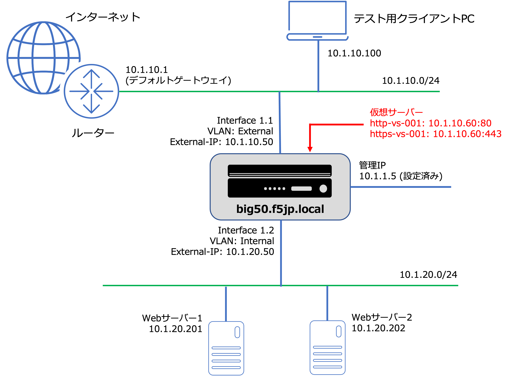

L3構成: スタンドアローンのネットワーク・サンプル
======================================

冗長化しない状態のL3構成を想定して、1台のみ設定していきます。

BIG-IPのVirtual Serverは"10.1.10.60:80"と"10.1.10.60:443"の2つを設定します。

プールメンバーは、以下の2つです。

| **10.1.20.201:80**
| **10.1.20.202:80**

| BIG-IPのデフォルトゲートウェイは、インターネット方向を想定したルーター"10.1.10.1"に設定します。
| 動作確認は、テスト用に設置したPC (図中の「テスト用クライアントPC」)から行います。