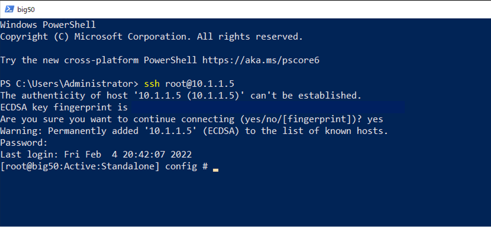

管理ポートへのSSHアクセス
======================================

- BIG-IPに対して、ターミナルソフトを使ってSSHアクセスが可能です。F5 UDF Labでは、テスト用クライアントPCのPowerShellやコマンドプロンプトから、SSHコマンドでアクセスできます。

- ログインすると、以下のようなコマンドプロンプトが表示されます。

.. code-block:: bash
   
   [root@big50:Active:Standalone] config #

- SSH Keyを設定してUDF Lab上のBIG-IPにアクセスする方法については、以下の情報をご参照ください。
https://help.udf.f5.com/en/articles/3832165-how-to-join-an-f5-training-course
