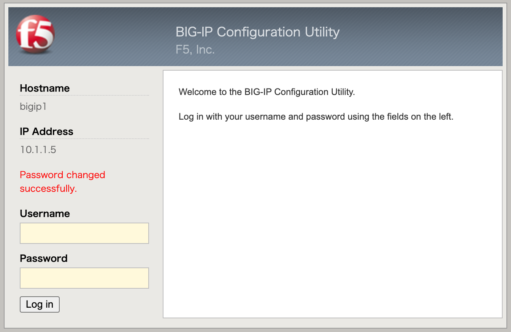
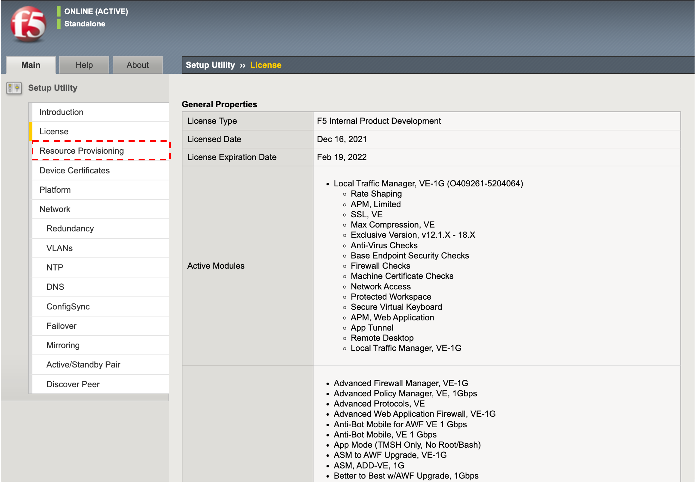

管理ポートへのGUIアクセス
======================================

- 管理用PCから設定したBIG-IPの管理IPアドレスへ、HTTPSでアクセスします。デフォルトの証明書は正式に取得した証明書ではないため、以下のような画面が現れますが、「続行する」を選択してください。

- ログイン画面が現れますので、以下のデフォルトのIDとPasswordでログインしてください。
| Username: **admin**
| Password: **admin**

.. note::
   バージョン14.0より、デフォルトでBIG-IPのセキュアパスワードポリシーが有効となっています。パスワードポリシーを変更しない限り、v13.0以前のデフォルトパスワードは利用できません。

本ガイドでは以下のように設定し、「Save」ボタンを押します。

| Current Password: **admin**
| New Password: **ilovef5**
| Confirm: **ilovef5**

- 設定したパスワードでログインし直します。

- 「Next」ボタンを押します。

- ライセンス画面が出ます。「Next」ボタンを押します。

(中略)

- プロビジョニング画面がでますが、デフォルトでLTMが選択されているので、そのまま「Next」ボタンを押します。

- SSL証明書の確認がなされますが、デフォルトのまま、「Next」ボタンを押します。

- ホスト名、タイムゾーン、Rootのパスワードを設定します。「Next」ボタンを押します。

.. note::
   IPv4アドレスについては、F5 UDF Labでは設定済みなので、変更不要です。

- この後、Standard Network Configurationの「Next」を押すことでウィザード形式にて冗長化も含めた設定が可能ですが、ここではスタンドアローン構成にするため、Advanced Network Configurationの「Finished」ボタンを押します。

