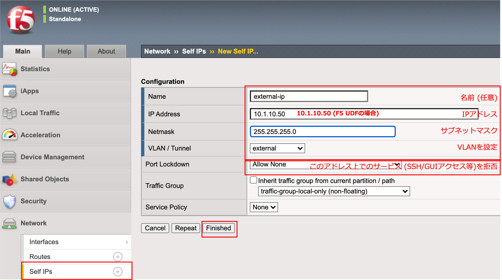
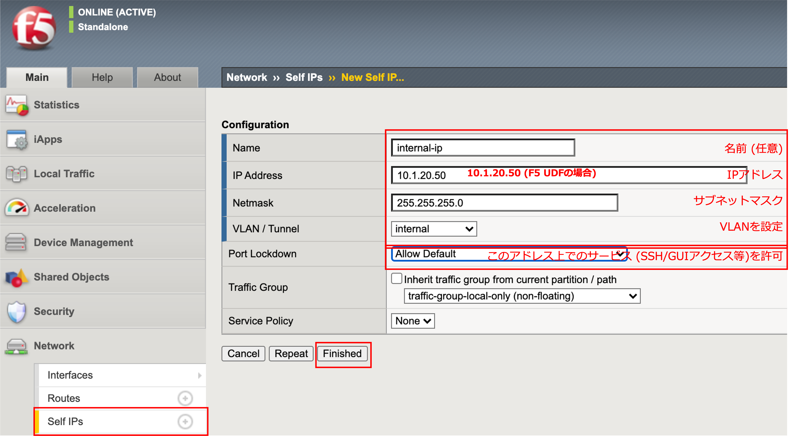
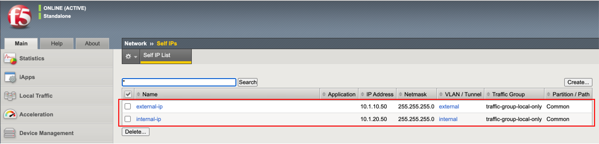

Self IPの設定
======================================

| BIG-IPに設定したVLANそれぞれに対して、IPアドレスを設定します。このIPアドレスのことを“Self IP“と呼びます。
| 「Network」 → 「Self IPs」で表示された画面の右上にある「Create」ボタンを押します。

- External VLANのSelf IPを設定します。

- Internal VLANのSelf IPを設定します。

- 一覧では、以下のような状態になります。

