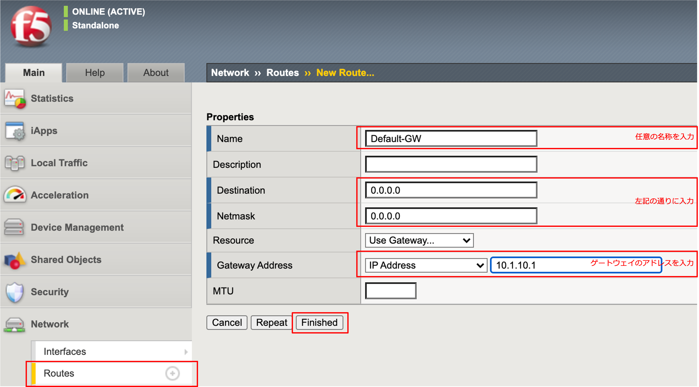
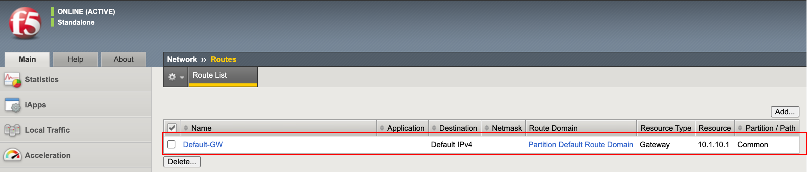
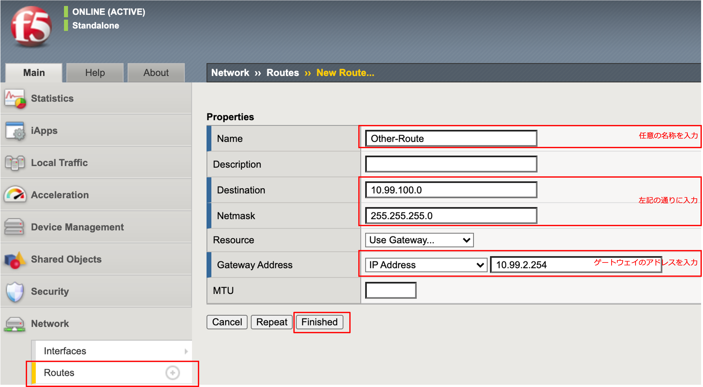

ルーティングの設定
======================================

デフォルトゲートウェイの設定
--------------------------------------

- 「Network」 → 「Routes」で表示された画面の右上にある「Add」ボタンを押します。以下の通り入力し、「Finished」を押します。 

- 設定後は、以下の状態になります。

その他ルーティング設定 (参考)
--------------------------------------

- 例として10.99.100.0/24へ到達するためのルーティングを、同様に設定します

.. note::
   F5 UDF Labでは設定不要です。

