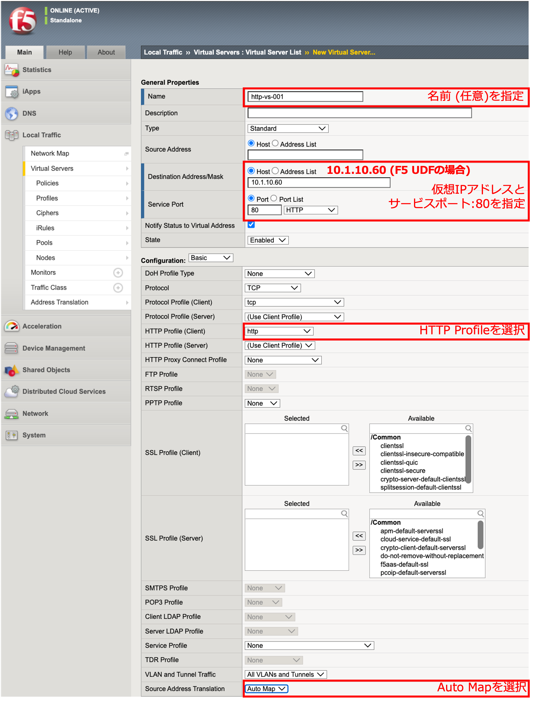

HTTP (Port 80)のロードバランシング設定
======================================

Poolの作成
--------------------------------------

まず、Poolから作成します。Poolは、ロードバランス対象の複数サーバの集合を指します。

- 「Local Traffic」 → 「Pools」で表示された画面の右上にある「Create」ボタンを押します。

- Poolが作成されると、以下の状態になります。

- 作成した「http-pool-01」をクリックし、「Members」タブをクリックします。以下のように、Statusがグリーンであればヘルスモニターが成功しています。

.. figure:: images/mod5-1-1-3.png
   :scale: 20%
   :align: center

HTTP (80)のVirtual Serverの作成
--------------------------------------

次にHTTP Virtual Server (Port 80)を作成します。

- 「Local Traffic」 → 「Virtual Servers」で表示された画面の右上にある「Create」ボタンを押して表示された画面で、以下のように設定します。　

(中略)

.. figure:: images/mod5-1-2-2.png
   :scale: 20%
   :align: center

- Statusがグリーンであれば、正常に動作していることを示します。

.. _client:

クライアントからのHTTPアクセス
--------------------------------------

- テスト用クライアントから、作成したVirtual ServerへWebブラウザでアクセスし、Web画面が表示されることを確認します。
- 「Statistics」 → 「Module Statistics」 → 「Local Traffic」タブをクリックします。
- 「Statistics Type」のプルダウンメニューから、「Pools」を選択します。
- それぞれのWebサーバの、Bits, Packets等のカウントがアップしていることを確認し、ロードバランシングが正常に行われていることを確認します。

カウンタをリセットしたい場合には、「Status」左横のチェックボックスにチェックを入れて、「Reset」ボタンを押します。