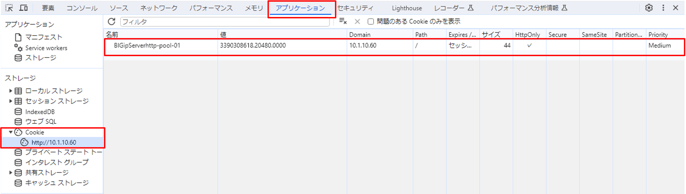

パーシステンス設定
======================================

| ロードバランシングメソッドに従って1つのサーバに振り分けられた後、継続して同じサーバへアクセスしたい、という要望があります (例: 買い物系サイト，インターネットバンキング)。このような要望を実現する機能をパーシステンスと呼びます。
| 
| 本ガイドでは、送信元IPアドレスパーシステンスとCookieのパーシステンス設定を行います。

送信元IPアドレスによるパーシスタンス
--------------------------------------

- 「Local Traffic」 → 「Virtual Servers」で表示されたバーチャルサーバ：http-vs-001を選択し、Resourcesタブをクリックすると、以下の画面が表示されます。
- 以下のように設定します。

.. _label:

クライアントからのHTTPアクセス
--------------------------------------

テスト用クライアントから、作成したVirtual ServerへWebブラウザでアクセスし、Web画面が表示されることを確認します。Staticticsを見て、負荷分散されずに同じサーバへのみ振り分けられていることを確認します。

Cookieによるパーシスタンス
--------------------------------------

以下のように設定します。

クライアントからのHTTPアクセス
--------------------------------------

:ref:`label` と同内容を確認し、ブラウザの設定でcookieが登録されていることを確認します。

**＜参考＞ Google Chromeの場合の確認手順**

- 画面右上の「︙」をクリックし、「その他のツール」 → 「デベロッパー ツール」を選択します。
- 「Application (アプリケーション)」タブを選択し、「Storage (ストレージ)」 → 「Cookies (Cookie)」を選択して、Cookieの内容を確認します。

.. note::
   確認ができたら、次項以降のテストのために、Persistance ProfileをVirtual Serverの設定からはずします。

