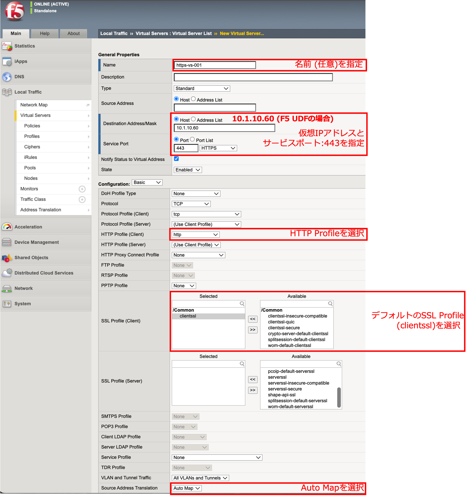

HTTPS (Port 443)のロードバランシング設定: ［パターンA］簡易的な設定方法
======================================

HTTPS仮想サーバとして動作することだけを確認するのであれば、デフォルトで用意されているSSL Profileを使うことで、容易に実施できます。

HTTPSバーチャルサーバの設定
--------------------------------------

- 「Local Traffic」 → 「Virtual Servers」で表示された画面の右上にある「Create」ボタンを押して表示された画面で、以下のように設定します。

(中略)

.. figure:: images/mod5-3-1-2.png
   :scale: 20%
   :align: center

クライアントからのHTTPSアクセス
--------------------------------------

 :ref:`client` 参照。 

テスト用クライアントから、作成したVirtual Server (HTTPS)へアクセスし、正常にSSL処理が行われることを確認します。
