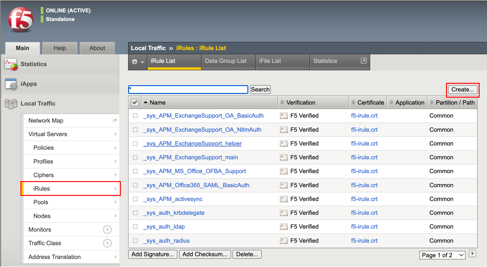
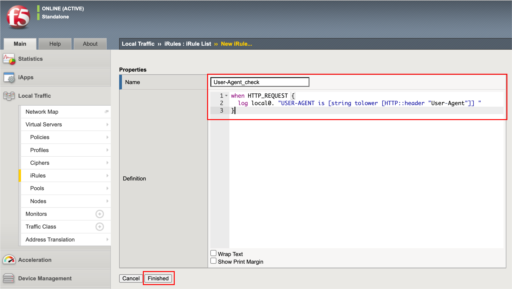
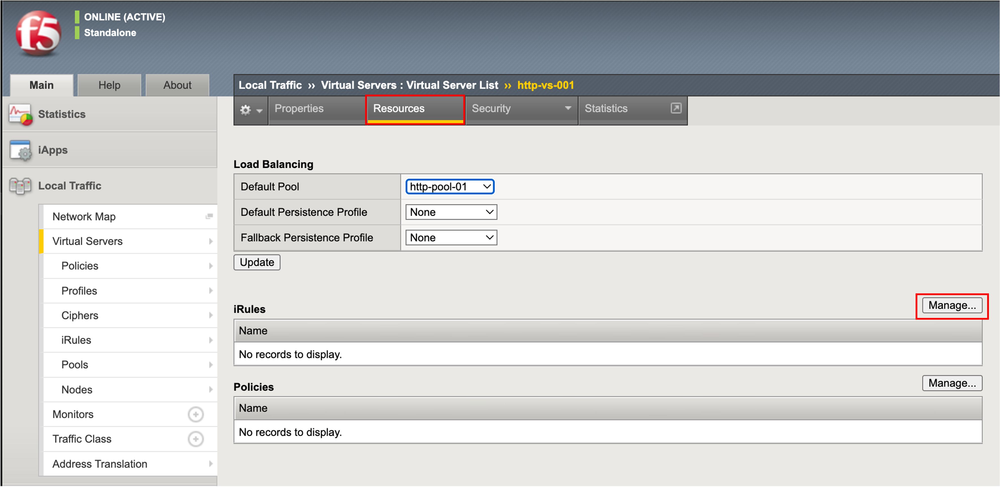
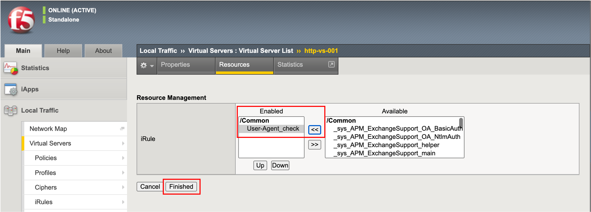
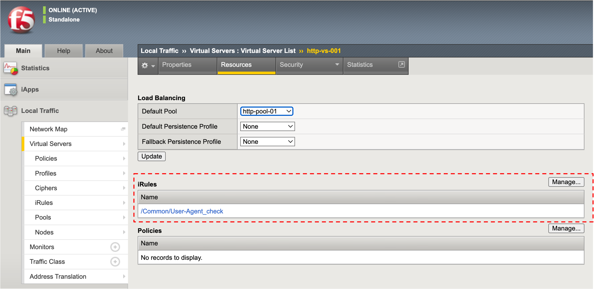

User-Agentを取得する
======================================

まずiRulesを使って、User-Agentの値を取得してみます。

User-Agentヘッダによる制御
--------------------------------------

- 「Local Traffic」 → 「iRules」において、右上のCreateボタンを押します。

- User-Agentを、ログファイルへ出力するiRuleを入力します。設定後、Finishedボタンを押します。

.. code-block:: bash

   when HTTP_REQUEST {
     log local0. "USER-AGENT is [string tolower [HTTP::header "User-Agent"]] "
   }

- 次に、作成したiRuleをVirtual Serverへ適用します。 「Local Traffic」 → 「Virtual Server」で表示された設定済みのVirtual Serverを選択し、画面の上に表示された「Resources」タブをクリックします。iRulesの部分の「Manage」ボタンを押します。

- 作成したiRuleを選択し、「<<」ボタンを押します。

- 以下の状態になります。

このiRuleで出力されるログは、以下の手順でBIG-IPにSSHでアクセスし、コマンドラインで確認します。

BIG-IPへのSSHアクセス
--------------------------------------

:doc:`../../content03/module02/module02` を参照。

User-Agentをログ上で確認
--------------------------------------

- 以下のコマンドを実行します。

上図1-6のIPアドレスが必要になりますので、あらかじめご用意ください。

.. code-block:: bash

   [root@bigXXX:Active:Standalone] config # tail –f /var/log/ltm

- クライアントPCで、iRuleを設定したVirutal Serverへ、ChromeおよびFirefoxから以下2つのブラウザからアクセスします。

- /var/log/ltmに、以下のようなログ (例)が出力されます。
**Chromeの場合**

.. code-block:: bash

   Jun 27 17:44:11 big50 info tmm1[9735]: Rule /Common/User-Agent_check <HTTP_REQUEST>: USER-AGENT is mozilla/5.0 (windows nt 10.0; win64; x64) applewebkit/537.36 (khtml, like gecko) chrome/75.0.3770.142 safari/537.36

**Firefoxの場合**

.. code-block:: bash
   
   Jun 27 17:43:53 big50 info tmm1[9735]: Rule /Common/User-Agent_check <HTTP_REQUEST>: USER-AGENT is mozilla/5.0 (windows nt 10.0; wow64; rv:65.0) gecko/20100101 firefox/68.0

