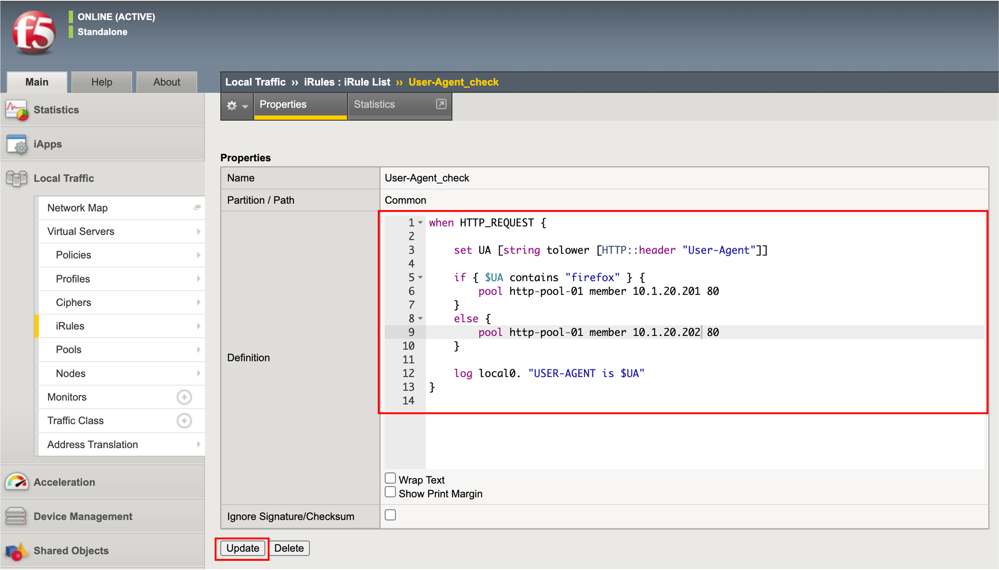

User-Agent毎にアクセス先Pool Memberを変える
======================================

上記のUser-Agent出力結果から、User-Agentに「firefox」の文字を含むものを10.1.20.201:80へ送り、それ以外は、10.1.20.202:80へ送る、というルールを設定することにします。

- 先程作成したiRulesを以下のように変更します。Updateボタンを押します。

.. code-block:: bash

   when HTTP_REQUEST {

       set UA [string tolower [HTTP::header "User-Agent"]]
    
       if { $UA contains "firefox" } {
           pool http-pool-01 member 10.1.20.201 80
       }
       else {
           pool http-pool-01 member 10.1.20.202 80
       }
       
       log local0. "USER-AGENT is $UA"
   }

- クライアントPCで、iRuleを設定したVirtual Serverへ、FirefoxおよびChromeからアクセスします。
- それぞれが、iRuleで指定したPool Memberへのみアクセスしていることを確認します。
- iRule内のPool MemberのIPアドレスを入れ替えてみて、同様の確認を実施してみてください。FirefoxとChromeで、アクセス先が入れ替わります。