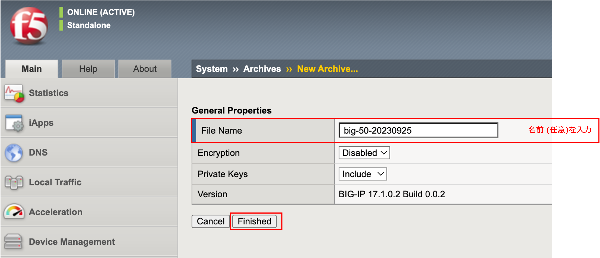
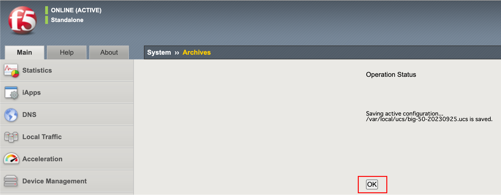
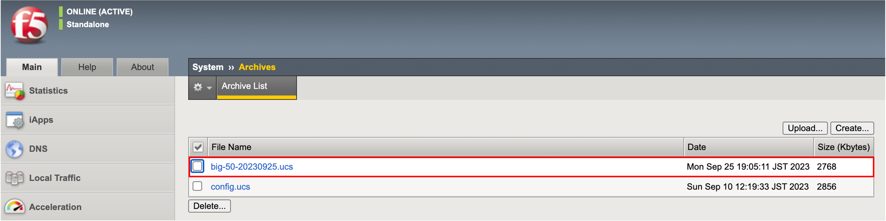
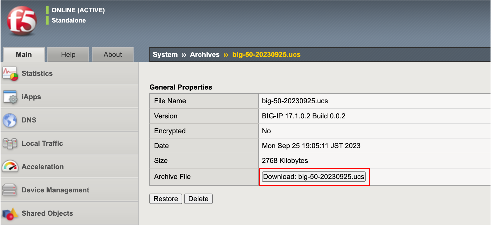
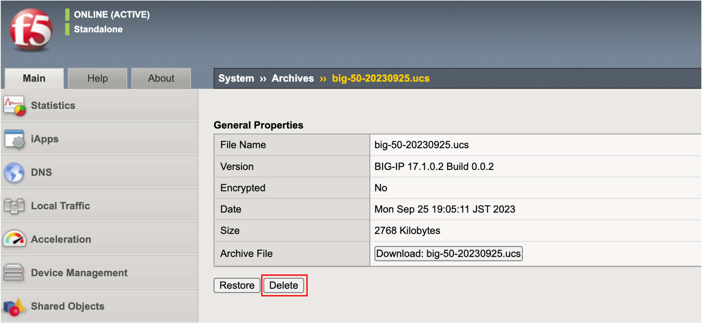

================================================
UCSの取得
================================================

UCS (User Configuration Set)アーカイブを取得することで、現時点までの設定を保存しておくことができます。

- 「System」 → 「Archives」 で表示された画面右上の「Create」ボタンを押します。任意の名称 (後に利用する際に分かりやすい名称)を入力し、「Finished」ボタンを押します。

- 「OK」ボタンを押します。

- 以下の状態になります。

- UCSファイル名をクリックすると、以下の画面になります。本ガイドでは、このUCSファイルをPCへダウンロードしておきます。Archive Fileを選択し、ダウンロードします。

- このままUCSファイルをBIG-IP内に保存したままでもよいのですが、本ガイドでは、UCSをBIG-IPへアップロードして復元することを確認するために、ここでは一旦このUCSを削除します。

UCSファイルによる復元動作を確認するために、次のステップで全コンフィグを消去します。
