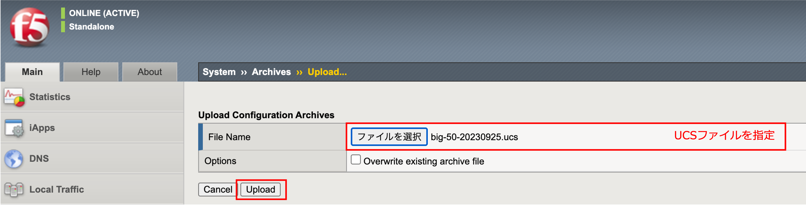
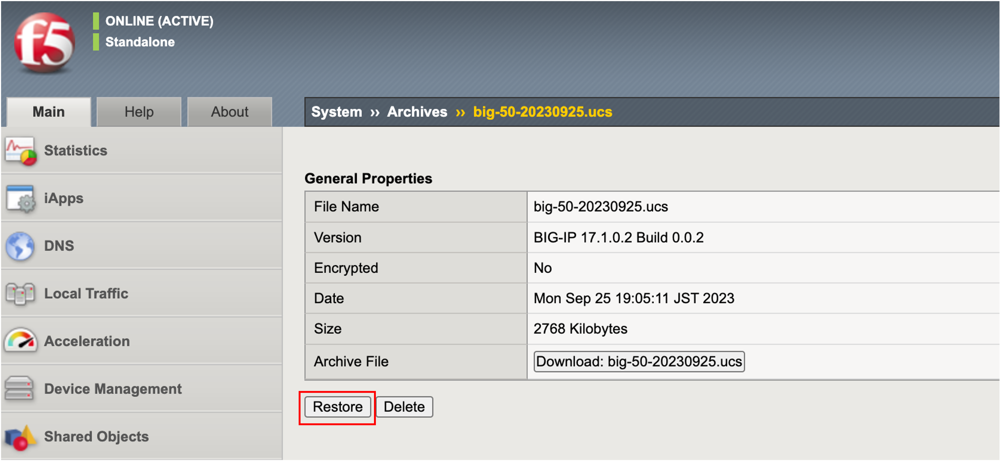
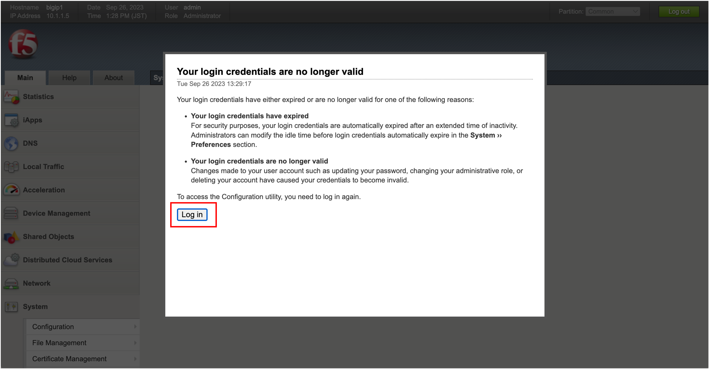

================================================
UCSのリストア
================================================

初期化したBIG-IP (big50.f5jp.local)を、UCSファイルで復元します。

- 一度デフォルドパスワード (admin/admin)でログオンし、パスワードを再設定します。

| F5 LABでは以下のように設定し、Saveボタンを押します。
|   Current Password: **admin**
|   New Password: **ilovef5**
|   Confirm: **ilovef5**

.. figure:: images/mod9-1.png
   :scale: 50%
   :align: center

- 設定したパスワードでログインします。

.. figure:: images/mod9-2.png
   :scale: 50%
   :align: center

- ブラウザでBIG-IPへアクセスすると、最初に設定したウィザード画面が現れます。

- UCSファイルで設定を戻すので、ウィザードで設定する必要はありません。よって、このウィザードをコマンドラインで停止します。

.. code-block:: bash

   [root@localhost:Active:Standalone] config # tmsh modify sys global-settings gui-setup disabled

- もう一度BIG-IPへブラウザでアクセスすると、以下の画面に変わります。(ウィザードが開始されません。)

- コマンドラインで、ログをtailし、ucsリストア状況を確認する設定をします。

.. code-block:: bash

   [root@localhost:Active:Standalone] config # tail -f /var/log/ltm | grep ucs

- 「System」 → 「Archives」 で表示された画面右上の「Upload」ボタンを押します。保存しておいたUCSファイルを指定して、Uploadします。

- アップロードしたUCSファイルをクリックします。

.. figure:: images/mod9-6.png
   :scale: 20%
   :align: center

- 「Restore」ボタンを押します。

- 以下の状態のときは、「OK」ボタンを押さず、しばらく待ちます。

「OK」を押しても問題はないのですが、次の画面に遷移すると、リストアが完了することを示すログを確認することができないので、いつ完了したのかがわかりにくいため、ここでは「OK」を押さずにしばらく待ちます。つい、「OK」を押してしまった場合にも、しばらく待てば、リストアは完了します。

.. note::
   一時的に以下のようなメッセージが表示されることがありますが、その場合はそのままお待ちください。

   .. figure:: images/mod9-9.png
      :scale: 70%
      :align: center

- コマンドラインのログを確認し、以下のようにUCSリストアが成功するまで待ちます。

.. code-block:: bash

   [root@localhost:Active:Standalone] config # tail -f /var/log/ltm | grep ucs
   Feb  3 22:46:38 localhost.localdomain info tmsh[24320]: Begin config install operation: /var/local/ucs/big-50-20220131.ucs
   Feb  3 22:46:43 localhost.localdomain notice logger[22221]: /usr/bin/perl /usr/local/bin/im -exclfrom -q -force /var/local/ucs/big-50-20220131.ucs  ==> /bin/bigstart stop named
   Feb  3 22:46:43 localhost.localdomain notice logger[22235]: /usr/bin/perl /usr/local/bin/im -exclfrom -q -force /var/local/ucs/big-50-20220131.ucs  ==> /bin/bigstart stop zrd
   Feb  4 15:46:47 localhost.localdomain info install_ucs.pm[22079]: Install the license file from UCS onto the system.
   Feb  4 15:46:49 localhost.localdomain notice logger[23193]: /usr/bin/perl /usr/local/bin/im -exclfrom -q -force /var/local/ucs/big-50-20220131.ucs  ==> /bin/bigstart stop restjavad restnoded
   Feb  4 15:46:49 localhost.localdomain notice logger[23312]: /usr/bin/perl /usr/local/bin/im -exclfrom -q -force /var/local/ucs/big-50-20220131.ucs  ==> /bin/bigstart start named
   Feb  4 15:46:50 localhost.localdomain notice logger[23373]: /usr/bin/perl /usr/local/bin/im -exclfrom -q -force /var/local/ucs/big-50-20220131.ucs  ==> /bin/bigstart start zrd
   Feb  4 15:46:53 localhost.localdomain notice logger[23584]: /usr/bin/perl /usr/local/bin/im -exclfrom -q -force /var/local/ucs/big-50-20220131.ucs  ==> /bin/bigstart start restjavad restnoded
   Feb  4 15:47:35 big50.f5jp.local info install_ucs.pm[22079]: UCS installation success.

- 成功すると以下の画面になりますので、Log inボタンを押します。

- 設定済みのIDとパスワードでログインし、Virtual Server等の設定が復元されていることを確認します。

.. toctree::
   :titlesonly:
   :caption: 目次:
   :glob:

   module**/module**