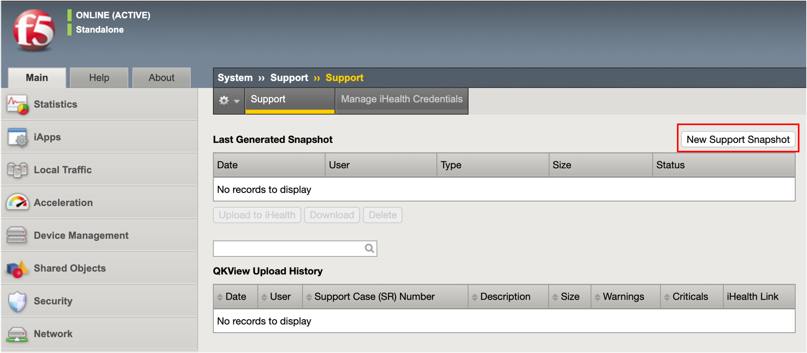
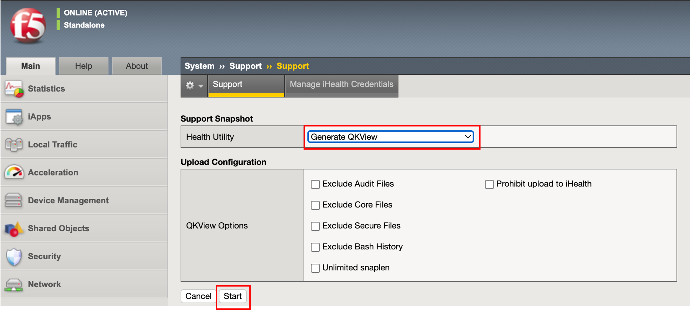
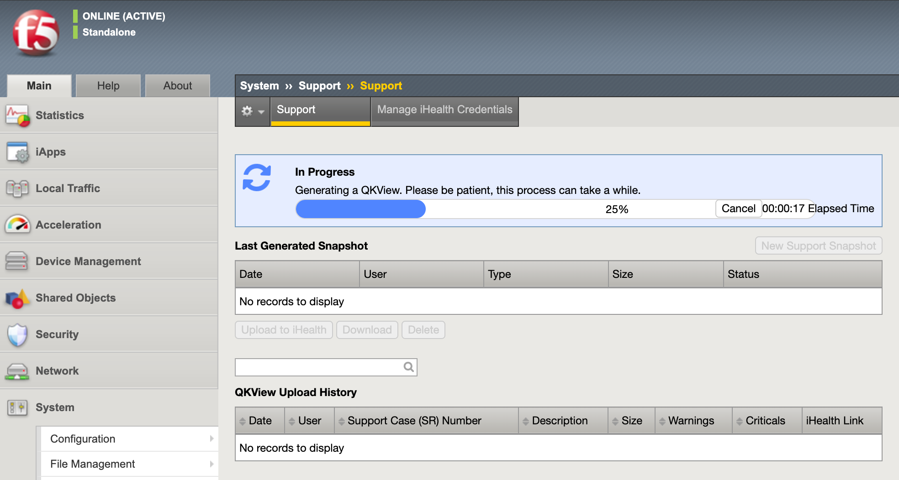
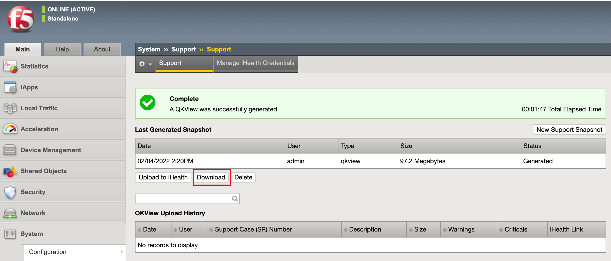

================================================
QKviewの取得
================================================

何らかの不具合発生時には、F5サポートへQKviewの送付が必要となります。以下にQKviewの取得方法を記載します。

- 「System」→「Support」で、以下の画面が表示されます。「New Support Snapshot」ボタンを押します。

- 「Health Utility」で「Generate QKView」を選択します。

上記で、「Generate and Upload QKView to iHealth」を選択すると、iHealthサイトにQKViewを直接アップロード可能となります。

iHealthはBIG-IPの設定データや過去１ヶ月分のログデータを閲覧できる大変便利なツールです (予め簡単なユーザ登録が必要です)。iHealthの詳細に関しては、以下のArticleに情報が掲載されております。

| K12878: Generating diagnostic data using the qkview utility
| https://my.f5.com/manage/s/article/K12878 

- 「Start」ボタンを押すと、QKViewの作成が開始されます。

- 完了すると、以下のような画面が表示されます。「Download」ボタンを押すと、QKviewファイルをダウンロードできます。

.. toctree::
   :titlesonly:
   :caption: 目次:
   :glob:

   module**/module**