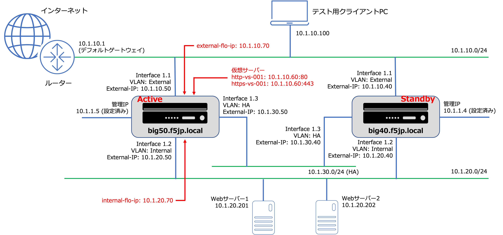

L3構成: 冗長化のネットワークサンプル
======================================

もう一台BIG-IPを追加して、L3構成の冗長化設定を行います。

[Active機 (big50.f5jp.local) 設定項目]

.. csv-table:: :header: "項目","名称","設定値"

   "ホスト名","","big50.f5jp.local"
   "管理インタフェース","","10.1.1.5"
   "Externalインタフェース","external","10.1.10.50"
   "Internalインタフェース","internal","10.1.20.50"
   "デフォルトゲートウェイ","Default-GW","10.1.10.1"
   "仮想サーバ (HTTP)","http-vs-001","10.1.10.60:80"
   "仮想サーバ (HTTPS)","https-vs-001","10.1.10.60:443"
   "Pool Member (Webサーバ1)","","10.1.20.201:80"
   "Pool Member (Webサーバ2)","","10.1.20.202:80"
   "HA用インタフェース","HA","10.1.30.50"
   "External共用 (floating)IPアドレス","external-flo-ip","10.1.10.70"
   "Internal共用 (floating)IPアドレス","internal-flo-ip","10.1.20.70"
   "NTPサーバ","","10.1.20.202"

[Standby機 (big40.f5jp.local) 設定項目]

.. csv-table:: :header: "項目","名称","設定値"

   "ホスト名","","big40.f5jp.local"
   "管理インタフェース","","10.1.1.4"
   "Externalインタフェース","external","10.1.10.40"
   "Internalインタフェース","internal","10.1.20.40"
   "デフォルトゲートウェイ","Default-GW","10.1.10.1"
   "仮想サーバ (HTTP)","","(設定同期によりコピー)"
   "仮想サーバ (HTTPS)","","(設定同期によりコピー)"
   "Pool Member (Webサーバ1)","","(設定同期によりコピー)"
   "Pool Member (Webサーバ2)","","(設定同期によりコピー)"
   "HA用インタフェース","HA","10.1.30.40"
   "External共用 (floating)IPアドレス","","(設定同期によりコピー)"
   "Internal共用 (floating)IPアドレス","","(設定同期によりコピー)"
   "NTPサーバ","","10.1.20.202"

このサンプルでは、NTPサーバを10.1.20.202とし、BIG-IPはこのサーバとの時刻同期を行うことします。
(冗長化を行うBIG-IP同士は、時刻を合わせておく必要があります。)

BIG-IP間のHA (High Availability) VLANは、冗長化の制御パケットをやり取りする専用のVLANです。ExternalやInternal VLANを利用することも可能ですが、HA専用のVLANを追加することを推奨しています。よって、本構成においては、HA VLANを追加しています。
