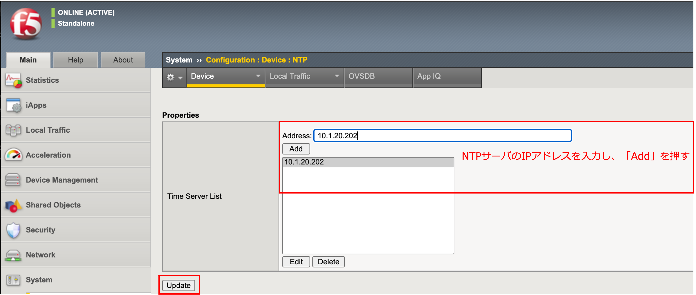

Active機 (big50.f5jp.local)の設定
======================================

HA VLANの設定
--------------------------------------

- 「Network」→「VLANs」で表示された画面の右上にある「Create」ボタンを押し、HA用VLANを設定します。

HA VLANのIP設定
--------------------------------------

- 「Network」→「Self IPs」で表示された画面の右上にある「Create」ボタンを押し、HA用VLANのIPを設定します。

.. figure:: images/mod11-3-2.png
   :scale: 20%
   :align: center

.. note::
   Allow Noneを選ぶとHAの通信も止めてしまい、HAが組めません。(ここでは **Allow Default** を選びます)

Deviceの設定
--------------------------------------

- 次に「Device Management」→「Devices」で、自分自身 (=big50.f5jp.local (Self))を選択します。

- 「ConfigSync」タブを選択し、HA VLANに指定したIPアドレスを選択し「Update」を押します。 

.. figure:: images/mod11-3-3-2.png
   :scale: 20%
   :align: center

- 「Failover Network」タブを選択し、「Add」ボタンを押します。

- HA VLANに設定したIPアドレスを選択します。

- 以下のような状態になります。

- 「Mirroring」タブを選択し、HA VLANに指定したIPアドレスをプライマリに指定します。任意ですが、ここではSecondaryとして、Internal VLANに指定したIPアドレスを選択しています。選択後、「Update」を押します。

時刻同期 (NTP)設定
--------------------------------------

- 「System」 → 「Configuration」 → 「Device」 → 「NTP」を選択します。Address欄に、NTPサーバのIPアドレスを入力し、「Add」ボタンを押します。

**[ご参考] NTP同期状態の確認**

NTP同期状態の確認は、コマンドラインから実施します。BIG-IPへのSSHアクセスの方法については、:doc:`../../content03/module02/module02` をご参照ください。

- SSHアクセスが完了したら、「ntpq -np」を実行します。 先頭に「＊」がついていれば、同期が完了しています。(同期完了状態になるまで、時間がかかる場合があります。)

.. code-block:: bash

   [root@big50:Active:Standalone] config # ntpq -np                                                                                                                                                                   
        remote           refid      st t when poll reach   delay   offset  jitter
   ==============================================================================
   *10.1.20.202     133.243.238.243  2 u   24   64    1    0.594   -0.321   0.299

