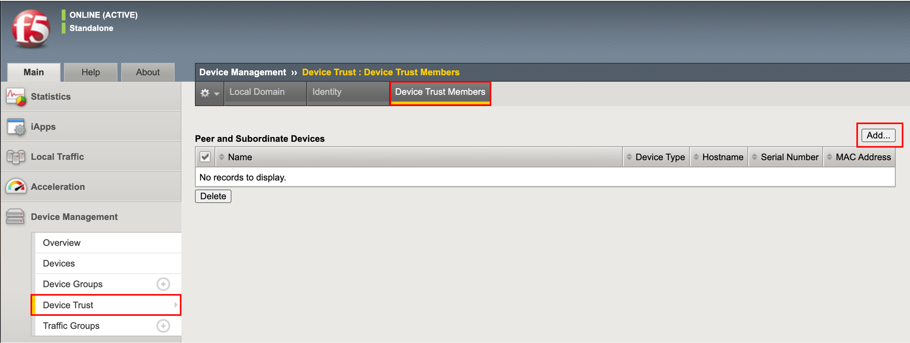
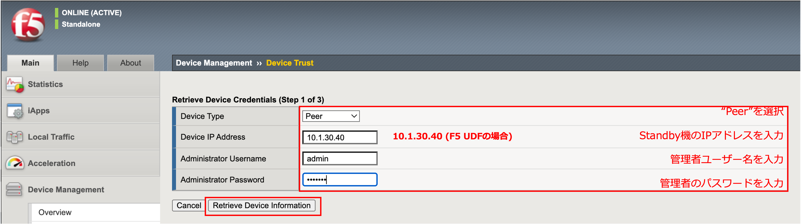
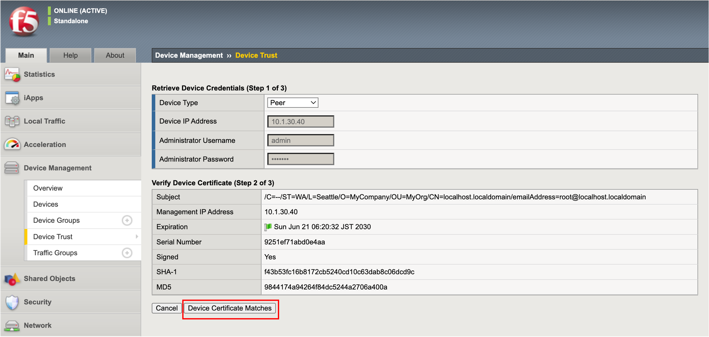
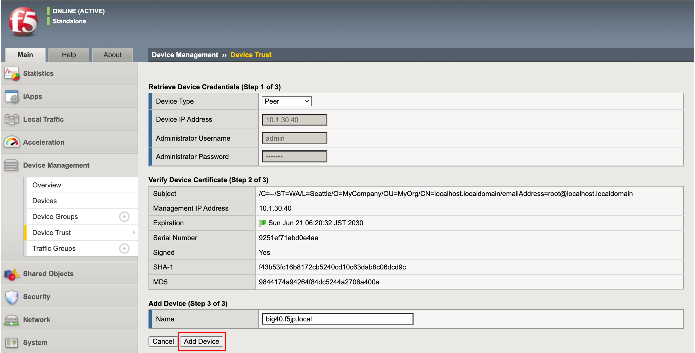
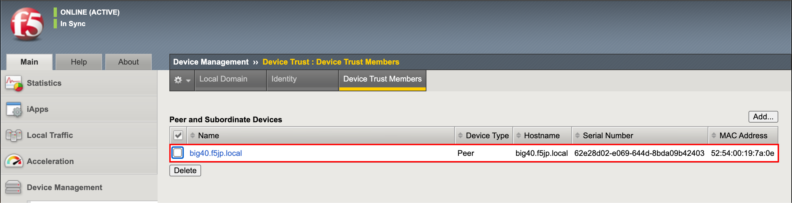
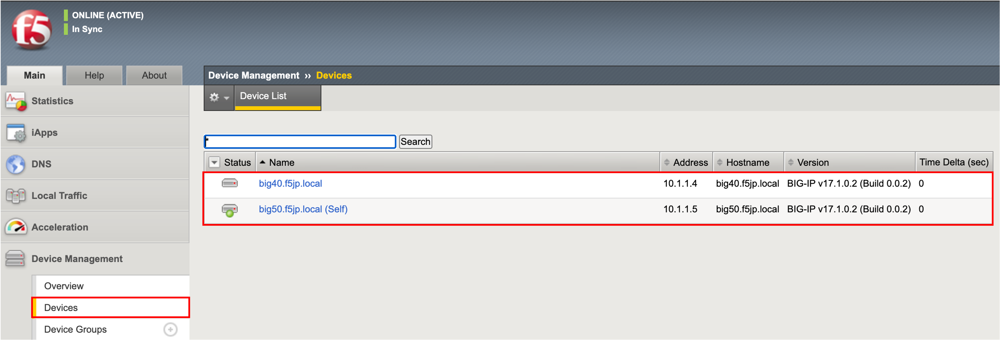

デバイストラスト設定 ※Active機 (big50.f5jp.local)側から実施
==========================================================

デバイストラスト設定にて、冗長化する機器間で信頼関係を結びます。

.. note::
   以降は、Active機 (big50.f5jp.local)からのみ、設定します。

- 「Device Management」→「Device Trust」→「Device Trust Members」を選択し、「Add」ボタンを押します。

- ”Peer“を選択し、Standby機 (big40.f5jp.local)のIPアドレスと管理者ID(Admin)とパスワードを指定します。「Retrieve Device Information」ボタンを押します。

- Standby機 (big40.f5jp.local)の証明書情報が表示されます。「Device Certificate Matches」ボタンを押します。

- Standby機のHostnameを確認し、「Add Device」を押します。

- 承認されたデバイスとして登録された状態です。

- 「Device Management」→「Devices」で見ると、bigip50.f5jp.local (self)に加え、Standby機 (big40.f5jp.local)も表示されます。 (ここは確認のみです。)

