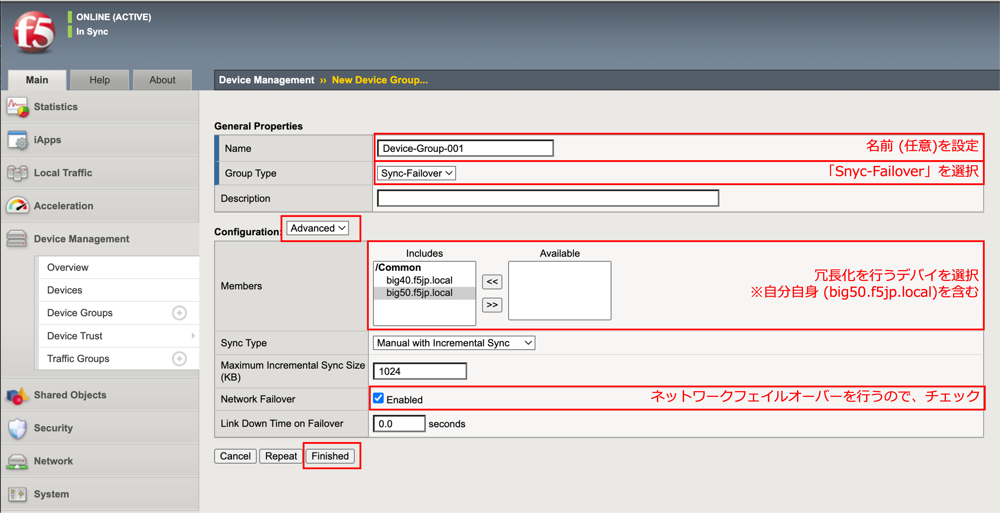
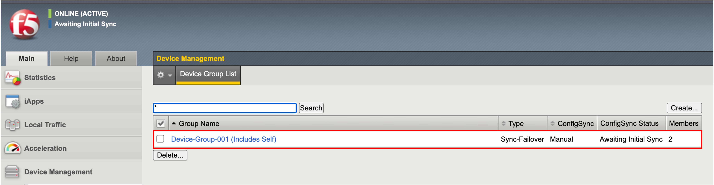

デバイスグループの設定
==========================================================

デバイスグループは、デバイストラストで信頼関係を結んだ機器の間で、どの機器間で冗長化を行うかの指定です。デバイストラストはBIG-IP×3台以上で構成することも可能で、例えば、1号機と2号機で冗長化を行い、2号機と3号機はコンフィグ同期のみ行う、という組合せが可能となっています。この組み合わせをデバイスグループで指定します。

2台で冗長化を行う場合はデバイスグループの組み方をあまり意識する必要はありませんが、設定は必要です。

.. note::
   以降は、Active機 (big50.f5jp.local)からのみ、設定します。

- 「Device Management」→「Device Groups」において、Createボタンを押し、以下のように入力します。

- デバイスグループが作られた状態です。

管理 (マネージメント)IPアドレスの4オクテット目の数字が大きい方が、デフォルトで”Active”となります。