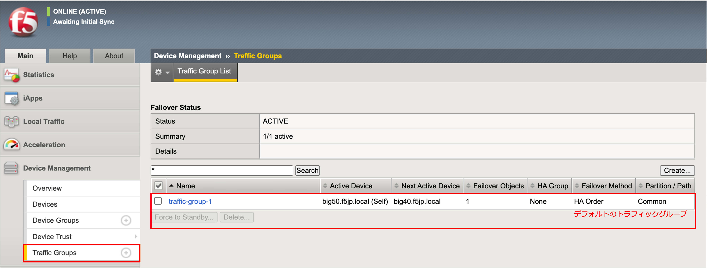
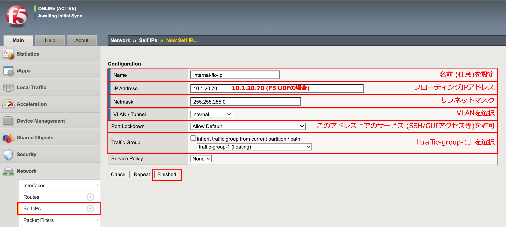
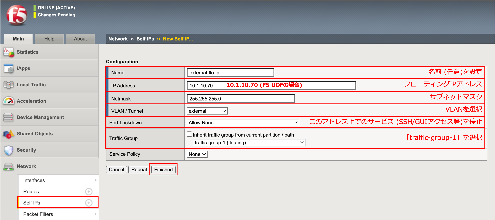
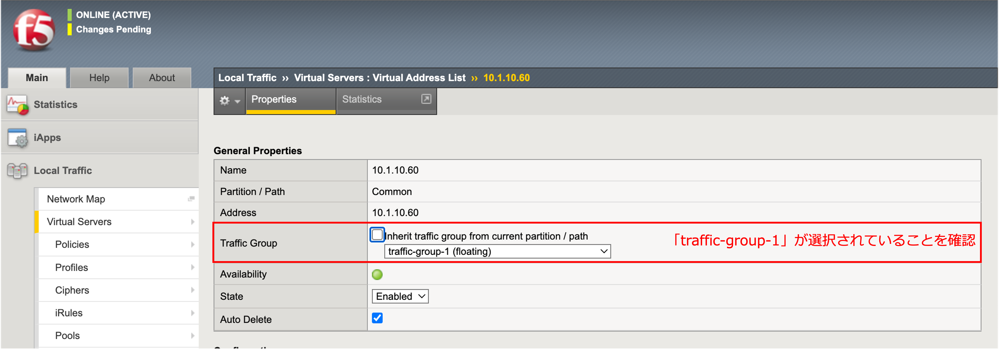
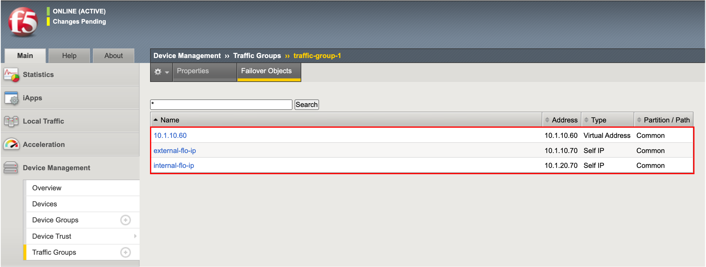

トラフィックグループの設定
==========================================================

トラフィックグループは、デバイスグループ内で移動するオブジェクトの集合です。主に、Virtual Serverと共用IP (Floating IP)がトラフィックグループのオブジェクトです。

.. note::
   以降は、Active機 (big50.f5jp.local)からのみ、設定します。

トラフィックグループの確認
--------------------------------------

- 「Device Management」→「Traffic Groups」を確認します。
- デフォルトで、「Traffic-group-1」という名前のトラフィックグループが存在しています。以降、このTraffic-group-1に対して、Floating IPおよびVirtual Serverを割当てていきます。 (ここでは確認のみです。)

Floating IPの設定
--------------------------------------

Floating IPは、Active機ダウン時にStandby機が引き継ぐ、自身に設定されたIPアドレス (Self IP)を指します。実サーバは、このIPアドレスをデフォルトゲートウェイに指定することで、Active/Standbyの切り替わり発生時にも、即座に通信を再開できます。

- Internal VLAN側の共用IP (Floating IP)を追加設定します。
- 「Network」→「Self IPs」で表示された画面右上の「Create」ボタンを押し、表示された画面で以下のように設定します。ここで、Traffic-group-1を選択することで、そのトラフィックグループに属させます。

- External VLAN側の共用IP(Floating IP)も追加設定します。

Virtual ServerとTraffic-Groupの紐付け (確認)
----------------------------------------------

- 「Local Traffic」→「Virtual Servers」→「Virtual Address List」を選択します。

このPropertiesのTraffic Groupで、「traffic-group-1」が選択されていることを確認します。

Traffic Groupに紐付けられたオブジェクトの確認
----------------------------------------------

- 「Device Management」→「Traffic Groups」のTraffic-group-1をクリックし、「Failover Objects」タブをクリックして、中身を確認すると、フェイルオーバーオブジェクトは以下のようになっています。

