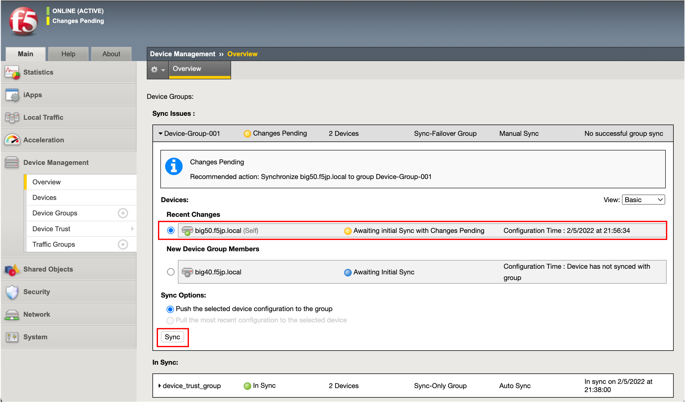
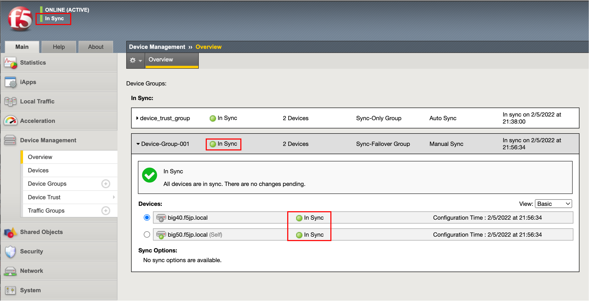

ConfigSync
==========================================================

Active機 (big50.f5jp.local)のみに行った設定を、Standby機 (big40.f5jp.local)に同期するために、ConfigSyncを行います。

.. note::
   以降は、Active機 (big50.f5jp.local)からのみ、設定します。
   

「Device Management」→「Overview」を選択すると、2つのDevice Groupが作成されています。

.. csv-table:: :header: "No","Device Group","説明"

   "Ⅰ","device_trust_group","trust groupにpeerを設定すると、システムによって自動的に作成されます。peerの基本情報をSyncします。"
   "Ⅱ","Device-Group-001 (任意の名前)","前項で作成したユーザ設定領域のデータをSyncします。"

Ⅰは自動でSyncされますが、ⅡはデフォルトでマニュアルSyncの設定となっています。Ⅱは初回設定時、またはUCSファイルからデータをリストアした後にSyncを実施する必要があります。

- 「Device Management」→「Overview」を選択します。Active機 (big50.f5jp.local)を選択し、「Sync」ボタンを押すことで、コンフィグ同期が行われます。

- しばらく待つと、コンフィグ同期が完了し、各ステータスがグリーンになり、状態が“In Sync”となります。

