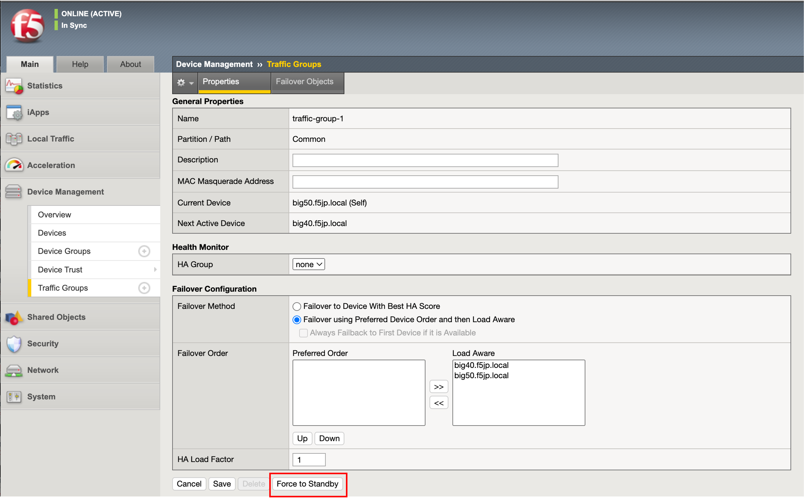
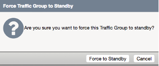
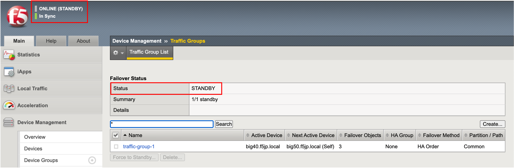
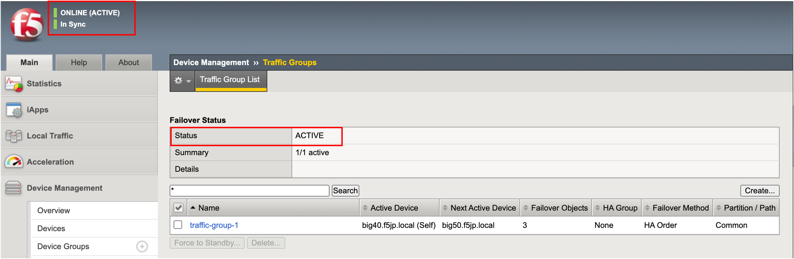

Traffic-group-1のActive/Standbyの切替え
==========================================================

Traffic-group-1のActive/Standbyの切替え
----------------------------------------

デフォルトでは、管理IPアドレス設定の大きい値を持つものがTraffic-group-1のActive機になりますが、マニュアルで強制的にActiveとStandbyを切替えます。

- アクティブ機の「Device Management」→「Traffic Groups」からTraffic-group-1を選択し、「Force to Standby」ボタンを押します。

- 確認のポップアップがでるので、「Force to Standby」ボタンを押します。

- その結果、ActiveからStandbyに変わります。

StandbyだったBIG-IPはActiveになります (※big40.f5jp.localで確認)。

クライアントからの接続確認
--------------------------------------

 :ref:`client` 参照。 

再度traffic-group-1の切替え、クライアントからの通信が復旧するかを確認してください。
